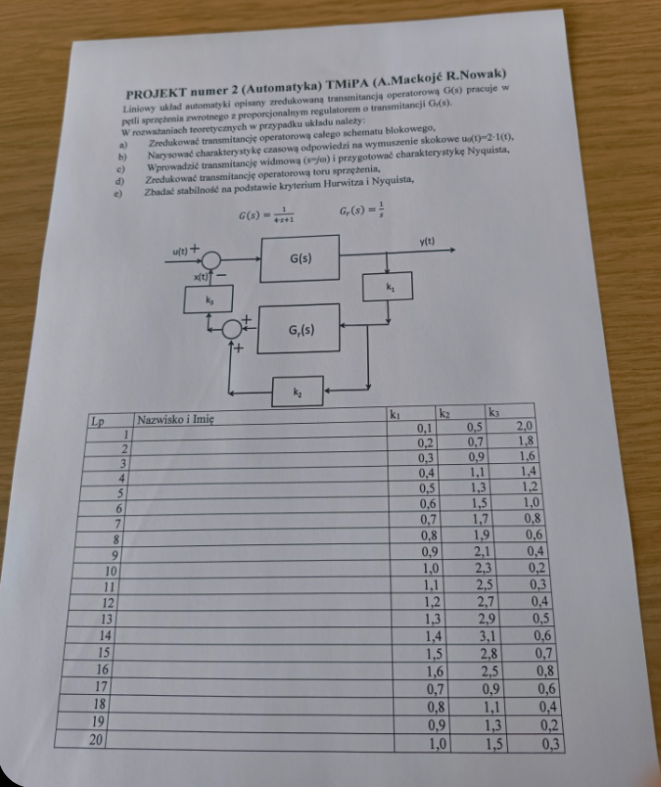

# Jak uruchomić
## 1. Zainstaluj uv (i dodatkowe zależności)
https://github.com/astral-sh/uv
Windows:
```pwsh
powershell -ExecutionPolicy ByPass -c "irm https://astral.sh/uv/install.ps1 | iex"
```
Ubuntu/Debian:
```
sudo apt install texlive-full -y
wget -qO- https://astral.sh/uv/install.sh | sh
```

## 2. Zmodyfikuj parametry
Utwórz plik `students.toml` na bazie `students.sample.toml` i wpisz odpowiednie parametry.

## 2. Uruchom kod
```pwsh
uv sync --upgrade
uv run main.py
```

## 3. Raport gotowy!
Szukaj pliku `Raport_TMiPA_IMIE_NAZWISKO.pdf`
*Uwaga! Jeśli raport się nie generuje, upewnij się, że MikTex jest zainstalowany.*

# Zadanie

